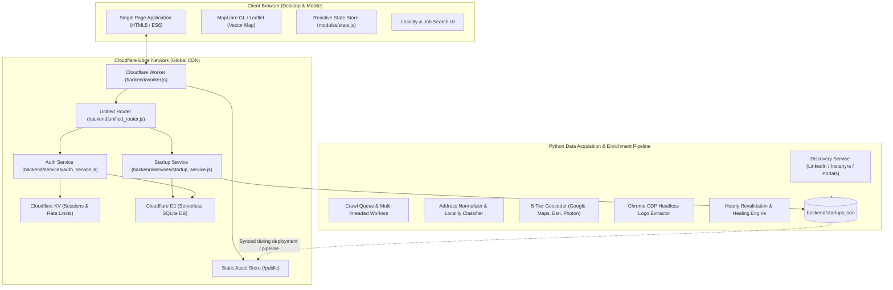

# System Architecture & Data Flow

> Architectural overview of MapMyJob (Startup & Job Visualizer), detailing edge computation on Cloudflare Workers, serverless D1/KV storage, client-side map rendering, and the offline Python data enrichment engine.

---

## 1. High-Level Architecture Overview

MapMyJob is architected as a **hybrid edge-computed, high-performance geospatial web platform**. It combines:
1. **Cloudflare Edge Workers**: Global sub-millisecond API routing, authentication, and search filtering.
2. **Client-Side Vector Map (MapLibre GL / Leaflet)**: Interactive hardware-accelerated map visualization with coordinate clustering, dynamic bounding box culling, and smooth animations.
3. **Serverless Data Tier (Cloudflare D1 & KV)**: SQLite-backed persistent relational store with fast distributed key-value session management.
4. **Asynchronous Python Data Pipeline**: Continuous web crawling, Chrome DevTools Protocol (CDP) logo extraction, address normalization, and multi-tier geocoding.



---

## 2. Component Breakdown

### 2.1 Cloudflare Worker Backend (`backend/worker.js`)
* **Runtime**: V8 JavaScript engine running on Cloudflare's global edge network (using `nodejs_compat` flags).
* **Asset Handling**: Intercepts requests for static files (`/static/*`, `/index.html`) using the Cloudflare `ASSETS` binding, returning them directly with aggressive caching headers.
* **API Dispatcher**: Forwards all `/api/*` routes to `unified_router.js`.
* **CORS & Security Headers**: Adds strict Content Security Policy (CSP), `X-Content-Type-Options: nosniff`, and secure CORS origin controls.

### 2.2 Unified Router (`backend/unified_router.js`)
* **Lightweight Routing**: Custom zero-dependency regex and path-matching router with parametric route extraction (e.g. `/api/startups/:id`).
* **Middleware Pipeline**:
  - `rateLimiterMiddleware`: Enforces client IP-based sliding window rate limits (configurable threshold, default 60 req/min).
  - `authMiddleware`: Parses and validates HMAC-SHA256 JWT tokens from secure cookies or `Authorization: Bearer` headers.
  - `corsMiddleware`: Handles preflight `OPTIONS` requests and sets access control headers.
* **Endpoints**:
  - `GET /api/startups`: Viewport-bounded, token-indexed startup & job search with filtering.
  - `GET /api/startups/:id`: Full details for a single company including founders, detailed job listings, and multi-office locations.
  - `GET /api/auth/google`: Initiates Google OAuth2 authorization flow.
  - `GET /api/auth/callback`: Exchanges Google OAuth authorization code for profile data and sets session JWT.
  - `GET /api/auth/me`: Validates user authentication status.
  - `POST /api/auth/logout`: Clears session tokens.
  - `GET /api/bookmarks` & `POST /api/bookmarks`: User-saved job and company bookmarks (D1-backed).
  - `GET /api/health`: System health and dataset version check.

### 2.3 Startup Service (`backend/services/startup_service.js`)
* **Unified Dataset Loading**: In development/Node environments, reads `backend/startups.json` with file modification time (`mtimeMs`) caching. In production Cloudflare Worker environments, fetches `startups.json` directly from edge asset bindings (`env.ASSETS`).
* **Multi-Office Support**: Startups contain an `offices` array. The service matches queries across all office locations (e.g. Bangalore HQ + Mumbai Branch), dynamically selecting the optimal office coordinate for viewport and locality queries.
* **Tokenized Search Indexing**: Substrings in name, description, office address, industry, founder names, job titles, departments, and required skills are tokenized and scored.
* **Salary & Experience Parsers**: Normalizes salary strings (e.g. "₹25L - ₹35L", "30,00,000 INR", "Competitive") and experience ranges into numeric filters.

### 2.4 Frontend Single Page Application (`public/`)
* **Zero Heavy Frameworks**: Built using pure modern ES6 modules without React/Vue overhead, achieving instant initial render (<200ms).
* **MapLibre GL / Leaflet Vector Map**: Renders map tiles, applies water body styling, loads India boundary overlays (`india_high_res.geojson`), and manages thousands of company markers.
* **Marker Overlap Deconfliction**: Spiral layout algorithm offsets markers located at identical GPS coordinates (such as tech parks or co-working spaces like WeWork or RMZ Ecospace).
* **Dynamic Viewport Culling**: Markers outside the active map bounding box are automatically detached from the DOM to maintain a constant 60 FPS frame rate.

---

## 3. Data Flow

### 3.1 Startup & Job Query Flow
```text
User Types Query / Pans Map 
   │
   ▼
[router.js: executeUnifiedSearch] ──▶ Local Geocode Cache Check
   │                                         │
   ├───────────────── (Cache Hit) ───────────┘
   ▼
[api.js: fetchStartups] ──▶ HTTP GET /api/startups?min_lat=...&city=...&q=...
   │
   ▼
[Cloudflare Edge Worker] ──▶ [unified_router.js] ──▶ [startup_service.js]
   │
   ▼
1. Filters startups matching geographic bounding box or canonical city.
2. Evaluates tokenized search against company name, office addresses, and job titles.
3. Filters by experience level, minimum salary, and work type (Remote / Hybrid / Onsite).
4. Sanitizes output fields (stripping internal crawler tags).
   │
   ▼
JSON Payload returned to Browser ──▶ [state.js: setStartups] 
   │
   ▼
[map_manager.js: updateMarkersDiff] ──▶ Reusable MapLibre marker pool updated
[ui_manager.js: renderCompanyList]  ──▶ Sidebar company cards updated
```

### 3.2 Google OAuth Authentication Flow
```text
User Clicks "Sign in with Google"
   │
   ▼
GET /api/auth/google ──▶ Redirects to accounts.google.com/o/oauth2/v2/auth
   │
User Authorizes Application
   │
   ▼
GET /api/auth/callback?code=...
   │
[auth_service.js] Exchanges authorization code with Google OAuth token endpoint
   │
Fetches Google user profile (sub, email, name, picture)
   │
Creates/Updates user record in Cloudflare D1 database (`schema.sql`)
   │
Issues cryptographically signed HMAC-SHA256 JWT cookie (`auth_token`)
   │
Redirects user back to application frontend with authenticated session state
```

---

## 4. Architectural Evolution: Monolith to Edge

| Phase | Original Architecture | Modern Edge Architecture | Benefit / Rationale |
| :--- | :--- | :--- | :--- |
| **Runtime** | Python Flask server running on single VPS/VM | Cloudflare Workers (V8 JavaScript Edge) | Global latency dropped from ~350ms to <25ms worldwide. |
| **Database** | Local SQLite file with file locks | Cloudflare D1 (Distributed SQLite) + Cloudflare KV | Zero server maintenance, serverless auto-scaling, and resilient replication. |
| **Search** | Server-side linear scan on every HTTP request | Edge-cached tokenized index + Client-side hash routing | Eliminated backend CPU bottlenecks, enabling instant multi-filter search. |
| **Map Rendering** | Heavy static map marker re-rendering | Vector map with dynamic viewport culling & marker reuse | DOM nodes reduced by 85%, eliminating mobile scroll stutter. |
| **Data Ingestion** | Monolithic scraper writing to local SQLite | Decoupled Python pipeline with automated revalidation & healing | Reliable continuous data updates without risking production site downtime. |

---

## 5. Security & Reliability Model

1. **Input Sanitization**: All incoming search queries, URLs, and authentication payloads pass through `backend/utils/validators.js` (`sanitizeString`, `sanitizeUrl`, `safeFloat`).
2. **Rate Limiting**: Sliding window rate limiter (`backend/utils/rate_limiter.js`) protects against brute-force crawlers and scrapers.
3. **Session Integrity**: JWT tokens are signed using high-entropy secrets, configured with `HttpOnly`, `SameSite=Lax`, and `Secure` attributes in production.
4. **Data Redundancy**: The canonical database is maintained in both `backend/startups.json` and mirrored in `public/static/data/startups.json` to enable edge worker asset serving.
