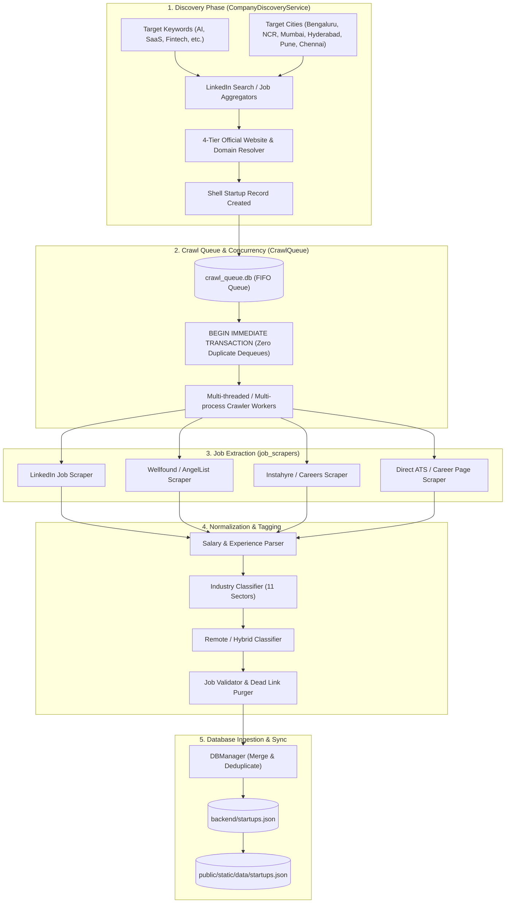

# Data Acquisition & Crawling Pipeline

> Comprehensive documentation of the Data Acquisition Engine, company discovery heuristics, official website resolution, multi-process crawl queue, job scrapers, and data ingestion pipeline.

---

## 1. Pipeline Life Cycle Overview

The Data Acquisition system operates as an autonomous, modular ETL (Extract, Transform, Load) pipeline designed to discover, crawl, validate, enrich, and merge tech startup records and job postings across Indian metropolitan tech hubs.



---

## 2. Discovery Engine (`pipelines/discovery/discovery_service.py`)

The discovery engine scans job portals using targeted keyword combinations (e.g. `Software Engineer`, `Frontend Developer`, `Product Manager`, `Machine Learning`, `Founding Engineer`) partitioned by metro city.

### 2.1 4-Tier Official Website & Domain Resolver
When a new company is discovered from a job listing, its official homepage and clean domain must be resolved automatically without human intervention. The resolver uses a 4-tier waterfall:

1. **Tier 1: Wikidata Knowledge Graph API (`wbsearchentities` / `wbgetentities`)**
   - Queries Wikidata for canonical entity labels.
   - Extracts property `P856` (Official Website).
   - Validates live HTTP response and domain safety.
2. **Tier 2: Clearbit Autocomplete API (`autocomplete.clearbit.com/v1/companies/suggest`)**
   - Queries company name against Clearbit's global brand index.
   - Matches candidate names using token similarity guards to prevent false positives.
   - Filters out non-Indian/foreign localized TLDs unless verified.
3. **Tier 3: DuckDuckGo HTML Search Scraper**
   - Searches `"{company_name} official website homepage"`.
   - Filters out social media aggregators (LinkedIn, Facebook, Twitter/X, Wikipedia, Naukri, Indeed, Glassdoor, Wellfound, Crunchbase, YCombinator).
   - Validates candidate domain via HTTP HEAD/GET request.
4. **Tier 4: Template Guess Fallback**
   - Constructs candidate URLs: `https://www.{slug}.com`, `.ai`, `.co`, `.tech`, `.io`.
   - Performs live DNS resolution and HTTP status checks (`200 OK`).

---

## 3. Persistent FIFO Crawl Queue (`pipelines/crawling/crawl_queue.py`)

To support multi-process, cross-terminal concurrency without external dependencies like Redis or RabbitMQ, the system uses an ACID-compliant SQLite FIFO queue (`backend/crawl_queue.db`).

### 3.1 Concurrency & Zero-Duplicate Guarantee
* **Atomic Dequeue**: Uses `BEGIN IMMEDIATE TRANSACTION` during `pop_task()`:
  ```python
  conn.execute("BEGIN IMMEDIATE TRANSACTION")
  cursor = conn.execute("""
      SELECT * FROM crawl_tasks
      WHERE status = 'PENDING'
      ORDER BY created_at ASC, id ASC
      LIMIT 1
  """)
  row = cursor.fetchone()
  if row:
      conn.execute("UPDATE crawl_tasks SET status = 'PROCESSING' WHERE id = ?", (row["id"],))
      conn.commit()
  ```
* **Task Lifecycle States**: `PENDING` ➔ `PROCESSING` ➔ `COMPLETED` or `FAILED`.
* **Dead Worker Recovery**: Tasks stuck in `PROCESSING` longer than 15 minutes are automatically reset to `PENDING`.

---

## 4. Multi-Source Scraping Engine

| Scraper Module | Target Platforms | Key Capabilities | Anti-Detection Techniques |
| :--- | :--- | :--- | :--- |
| **`linkedin_scraper.py`** | LinkedIn Jobs & Company Profiles | Extracts job titles, salary, experience, office location, and LinkedIn company avatar. | Exponential backoff, jitter delays (1.5s–3.5s), rotating User-Agents, session persistence. |
| **`wellfound_scraper.py`** | Wellfound (formerly AngelList) | Extracts startup funding stage, total raised, founder profiles, and equity ranges. | GraphQL endpoint interception, JSON payload parsing. |
| **`instahyre_scraper.py`** | Instahyre | Discovers tech stack tags, headcount ranges, and verified office addresses. | Clean HTML parsing with BeautifulSoup. |
| **`direct_career_scraper.py`**| Lever, Greenhouse, Workable, Ashby | Direct ATS API integration for live company job boards. | JSON API polling with rate limit awareness. |

---

## 5. Normalization, Classification & Validation

### 5.1 Salary & Experience Parsing (`backend/services/startup_service.js` & `data_acquisition/utils/validation.py`)
* **Salary Normalization**: Converts diverse formats into standardized yearly CTC in Lakhs (INR):
  - `"₹18,00,000 - ₹28,00,000"` ➔ `18.0 - 28.0 LPA` (Max: `28.0`)
  - `"25L - 35L"` ➔ `25.0 - 35.0 LPA`
  - `"Competitive / Not Disclosed"` ➔ `null` (Preserved as unconstrained)
* **Experience Parsing**:
  - `"Fresher / Entry"` ➔ `[0, 2] years`
  - `"3-5 yrs"` ➔ `[3, 5] years`
  - `"5+ years"` ➔ `[5, 100] years`

### 5.2 Industry Classification (`pipelines/tagging/classify_industries.py`)
Startups are classified into one of 11 primary sectors based on keyword weights across description, job openings, and tech stack tags:
1. **Artificial Intelligence** (LLMs, GenAI, Machine Learning, Computer Vision, NLP)
2. **Fintech** (Payments, Neobank, Lending, WealthTech, InsurTech)
3. **SaaS** (B2B SaaS, Cloud Management, Developer Tools, Analytics)
4. **HealthTech** (Telemedicine, Diagnostics, Biotech, Pharma)
5. **CleanTech** (EV, Solar, Renewable Energy, Sustainability)
6. **E-commerce** (D2C, Quick Commerce, Marketplaces, Retail)
7. **EdTech** (K-12, Upskilling, Higher Education, Learning Platforms)
8. **Cybersecurity** (Threat Intelligence, Identity, AppSec, Compliance)
9. **Logistics** (Supply Chain, Freight, Warehousing, Fleet Management)
10. **B2B** (Enterprise Solutions, Procurement, Industrial Tech)
11. **Service Industry** (IT Consulting, Development Agencies, Staffing)

### 5.3 Remote / Hybrid Classifier (`pipelines/tagging/remote_office_classifier.py`)
Classifies job and office types:
* **Remote**: Work from anywhere, no physical office attendance required.
* **Hybrid**: Defined office days per week.
* **On-site**: Requires physical presence at the specified office address.

---

## 6. Execution & Monitoring

To run the complete data acquisition and enrichment pipeline:

```bash
# Run Discovery for Bengaluru startups
python3 data_acquisition/pipelines/discovery/run_discovery.py

# Dispatch multi-threaded crawler workers
python3 data_acquisition/pipelines/crawling/dispatch_crawlers.py --workers=4

# Run all metro cities production batch
python3 data_acquisition/run_all_metro_cities_production.py

# Monitor crawl queue and pipeline status
python3 data_acquisition/monitor_pipeline.py
```
