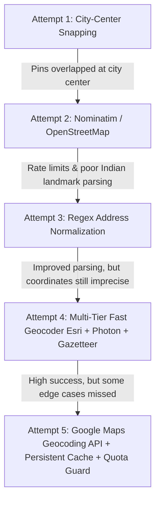
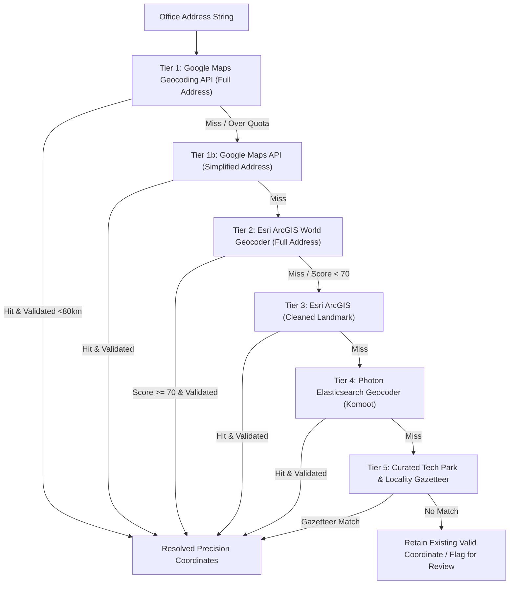

# Office Address Cleaning & Precision Geocoding

> Detailed engineering log, evolution, experiments, algorithms, caching mechanisms, quota protection, and multi-tier resolution for startup office addresses and GPS coordinates.

---

## 1. The Challenge of Indian Startup Addresses

Raw office addresses extracted from job boards, LinkedIn, and company websites in India present unique geospatial challenges:
1. **Excessive Boilerplate**: Addresses frequently include interior directions (e.g., *"4th Floor, Wing B, Block 2, Brigade Tech Gardens, Near Kundalahalli Gate, Whitefield, Bengaluru, Karnataka 560066"*).
2. **Ambiguous Landmarks**: Landmark-based phrasing (e.g., *"Opposite Forum Mall"*, *"Behind Manyata Gate 2"*) that breaks standard geocoding parsers.
3. **Co-working Hub Clustering**: Dozens of startups sharing identical co-working addresses (WeWork, Cowrks, Innov8, Awfis).
4. **Coordinate Drift & False Centers**: Naive geocoders snapping addresses to city-center centroids (e.g. `(12.9716, 77.5946)` for Bangalore) or out-of-bounds locations (>80km away in rural areas).

---

## 2. Evolution: What We Tried & Lessons Learned



### Attempt 1: City-Center Snapping & Bounding Boxes
* **Approach**: In initial prototypes, startups without verified GPS coordinates were assigned the canonical center of their city (e.g., MG Road / Cubbon Park for Bangalore).
* **Why it Failed**: Tens of companies clustered on a single point on the map, rendering the visualizer unusable for neighborhood-level discovery.

### Attempt 2: Public Nominatim / OpenStreetMap API
* **Approach**: Queried OpenStreetMap's public Nominatim instance on demand.
* **Why it Failed**:
  - Strict 1 request/second rate limit; caused HTTP 429 errors during batch enrichment.
  - Low accuracy for Indian tech parks (e.g. failed to resolve *"RMZ Ecoworld, Outer Ring Road"*).
  - Unstable latency (often >3.5 seconds per request).

### Attempt 3: Rule-Based Address Normalization (`db_manager.py`, `geo_config.py`)
* **Approach**: Built a rule-based regex cleaning engine to strip interior building noise before geocoding:
  ```python
  # Strips room, flat, floor, wing, tower, cabin, plot boilerplate
  cleaned = re.sub(
      r'\b(?:no\.|number|flat|door|unit|suite|room|cabin|floor|flr|plot|bldg|building|tower|wing)\s*[\w\d\-\/\&]+\b',
      '', address, flags=re.IGNORECASE
  )
  ```
* **Result**: Cleaned address strings significantly improved geocoder hit rates, but required high-quality backend geocoding engines.

### Attempt 4: Fast Precision Geocoder (`fast_precision_geocoder.py`)
* **Approach**: Implemented a 4-tier browser-free geocoding waterfall using Esri ArcGIS World Geocoder, Photon (Komoot Elasticsearch), and a curated Indian Locality & Tech Park Gazetteer.
* **Result**: Resolved over 85% of problematic addresses with high precision and sub-second execution speed.

### Attempt 5: Google Maps Geocoding API with Caching & Quota Protection (`google_maps_client.py`)
* **Approach**: Integrated Google Maps Platform Geocoding API as the Tier 1 engine, backed by a persistent two-layer cache and strict monthly quota limits.
* **Result**: Production-grade precision (exact building/rooftop lat/lng) with **$0 infrastructure cost** by staying comfortably within Google Cloud's $200 monthly free credit.

---

## 3. 5-Tier Geocoding Resolution Waterfall

When resolving or healing coordinates for an office address, `fast_precision_geocoder.py` executes the following prioritized waterfall:



---

## 4. Google Maps API Integration & Cost Management

### 4.1 Pricing & Monthly Credit Breakdown
Google Cloud provides a **$200 monthly recurring credit** for every active billing account.
* **Cost per Request**: $0.005 ($5.00 per 1,000 requests).
* **Monthly Free Volume**: Up to **40,000 geocoding calls/month** at $0 net cost.
* **MapMyJob Safety Budget Cap**: Configured to **8,500 calls/month** (`DEFAULT_MONTHLY_LIMIT = 8500`) in `google_maps_client.py`, providing a 4.7x safety buffer below the free tier threshold.

### 4.2 Persistent Two-Layer Caching
1. **Normalized Key Storage**: Addresses are lowercased, whitespace-collapsed, and punctuation-trimmed before lookup.
2. **On-Disk Persistence**: Cached entries are stored in `data_acquisition/cache/google_maps_cache.json`.
3. **Negative Caching**: If Google Maps returns `ZERO_RESULTS`, `None` is cached permanently to prevent redundant API queries for invalid strings.
4. **Quota Tracker**: Monthly usage is tracked in `data_acquisition/cache/google_quota_tracker.json`.

---

## 5. Locality & Tech Park Gazetteer

For instant offline fallback, `data_acquisition/fast_precision_geocoder.py` maintains a curated gazetteer of over 60 premier Indian tech parks and startup hubs:

| Metro City | Hub / Tech Park | Latitude | Longitude |
| :--- | :--- | :--- | :--- |
| **Bengaluru** | Manyata Tech Park (Hebbal) | `13.048700` | `77.620900` |
| **Bengaluru** | RMZ Ecoworld / Ecospace (Bellandur) | `12.922000` | `77.683300` |
| **Bengaluru** | Embassy Golf Links (EGL, Domlur) | `12.947200` | `77.639400` |
| **Bengaluru** | Prestige Tech Park (Marathahalli) | `12.941900` | `77.697400` |
| **Bengaluru** | Koramangala Startup Hub | `12.935200` | `77.624500` |
| **Bengaluru** | HSR Layout Sector 1–7 | `12.912100` | `77.644600` |
| **Bengaluru** | Electronic City Phase 1 & 2 | `12.845200` | `77.660200` |
| **Mumbai** | Bandra Kurla Complex (BKC) | `19.065700` | `72.868700` |
| **Mumbai** | Hiranandani Business Park (Powai) | `19.118900` | `72.911300` |
| **Mumbai** | Nirlon Knowledge Park (Goregaon) | `19.155700` | `72.859600` |
| **Delhi NCR** | DLF Cyber City (Gurugram) | `28.495000` | `77.089500` |
| **Delhi NCR** | Udyog Vihar Phase 1–5 (Gurugram) | `28.502400` | `77.081800` |
| **Delhi NCR** | Sector 62 / 125 Tech Hub (Noida) | `28.628800` | `77.368600` |
| **Hyderabad** | HITEC City & Mindspace | `17.443500` | `78.377200` |
| **Hyderabad** | T-Hub / Knowledge City | `17.444500` | `78.377200` |
| **Hyderabad** | Financial District (Gachibowli) | `17.426200` | `78.338900` |
| **Pune** | Hinjewadi IT Park (Phase 1–3) | `18.591300` | `73.738900` |
| **Pune** | Magarpatta Cybercity (Hadapsar) | `18.515800` | `73.927200` |
| **Pune** | EON Free Zone (Kharadi) | `18.551500` | `73.942700` |
| **Chennai** | OMR Tech Corridor (Thoraipakkam) | `12.941600` | `80.236200` |
| **Chennai** | Olympia Tech Park (Guindy) | `13.011800` | `80.201500` |
| **Chennai** | IIT-M Research Park (Taramani) | `12.991500` | `80.243500` |

---

## 6. Multi-Office Data Model & Architecture Rules

To maintain high data integrity across the platform, the following architectural invariants are enforced in `backend/startups.json`:

1. **Immutable Address Rule**: The text inside `office_address` is treated as immutable user-facing truth and is NEVER overwritten or truncated during geocoding passes.
2. **Zero Root Coordinate Pollution**: Startup objects MUST NOT have top-level `lat` or `lng` properties in the canonical database. All coordinates reside strictly inside the `offices` array:
   ```json
   {
     "id": 142,
     "name": "Postman",
     "city": "Bengaluru",
     "offices": [
       {
         "city": "Bengaluru",
         "office_address": "9th Floor, Tower D, IBC Knowledge Park, Bannerghatta Main Rd, Bengaluru, Karnataka 560029",
         "lat": 12.9348123,
         "lng": 77.5991456,
         "is_hq": true,
         "location_tagged": true
       }
     ]
   }
   ```
3. **80km Outlier Guard**: Any resolved coordinate exceeding 80km Haversine distance from the canonical metro city center is rejected to prevent geographic hallucinations.
4. **Continuous Edge Sync**: Upon running geocoding utilities, `backend/startups.json` and `public/static/data/startups.json` are automatically synchronized.
