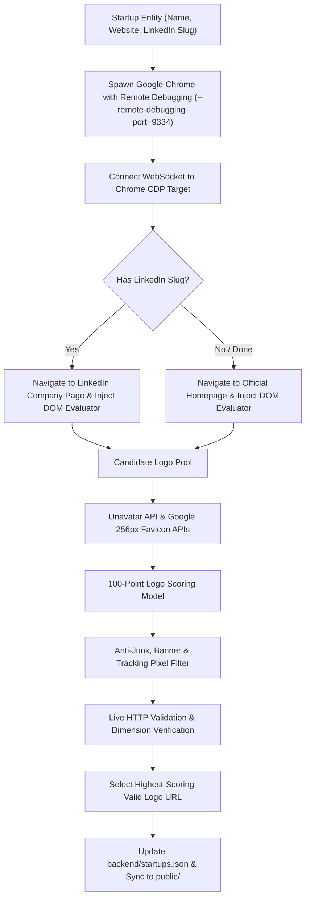

# Logo Extraction & Quality Scoring Pipeline

> Complete engineering guide to the multi-tier brand asset enrichment engine, Chrome DevTools Protocol (CDP) DOM inspection, 100-point scoring algorithm, anti-junk filtering, and fallback mechanisms.

---

## 1. Problem Statement: The Brand Asset Quality Challenge

Startup logos displayed as interactive map markers must satisfy strict visual requirements:
1. **Crisp Scalability**: Must remain sharp on high-DPI (Retina) displays when rendered at marker scales (32px to 64px).
2. **True Brand Identity**: Must accurately represent the company rather than returning marketing hero banners, founder headshots, or 1x1 tracking pixels.
3. **High Availability**: Must not rely on ephemeral CDN links or broken endpoints.

### Historical Shortcomings
* **Clearbit Logo API**: Frequently returned HTTP 404s for Indian early-stage startups or returned legacy logos.
* **Google S2 Favicon API**: Fast but capped at low resolutions (often blurry 16x16 or 32x32 icons stretched on high-res maps).
* **Static Web Scraping**: Standard HTTP requests missed logos rendered dynamically via React, Next.js, or client-side SVG sprite sheets.

---

## 2. Solution: Headless Chrome CDP Live DOM Extractor (`enrich_all_official_logos.py`)

To overcome client-side JavaScript rendering and anti-scraping walls, we developed an autonomous browser crawler utilizing the **Chrome DevTools Protocol (CDP)** over WebSockets.



---

## 3. 100-Point Logo Scoring Algorithm

Every candidate image URL harvested from the DOM or APIs is evaluated and assigned a quality score from 0 to 100:

| Quality Tier | Score | Source / Asset Type | Technical Criteria & Extraction Pattern |
| :---: | :---: | :--- | :--- |
| **Tier 1** | **100 pts** | **Vector SVG Brand Logo** | Clean `.svg` file found in `<link rel="icon">`, `<link rel="mask-icon">`, or within `<header>` / `<nav>` elements. Perfect vector scaling. |
| **Tier 2** | **95 pts** | **LinkedIn Company Avatar** | Official high-resolution avatar extracted from `licdn.com/dms/image/.../company-logo`. Verified square aspect ratio. |
| **Tier 3** | **90 pts** | **Apple Touch / High-Res Manifest Icon** | `<link rel="apple-touch-icon">` or Web App Manifest icon with dimensions `180x180`, `192x192`, `256x256`, or `512x512`. |
| **Tier 4** | **80 pts** | **High-Res Header PNG** | Brand image in navbar/header with natural width `≥ 100px` and height `≥ 30px`. |
| **Tier 5** | **65 pts** | **Unavatar API** | Verified logo from `https://unavatar.io/{domain}` with verified 200 OK status. |
| **Tier 6** | **55 pts** | **Google Favicon API (256px)** | High-res fallback: `https://www.google.com/s2/favicons?domain={domain}&sz=256`. |
| **Reject** | **0 pts** | **Junk / Banner / Low-Res** | Tracking pixels, GIFs, wide promotional banners, team photos, or broken URLs. |

---

## 4. Anti-Junk, Banner & Tracking Pixel Filtering

To ensure zero promotional images or ad banners pollute map pins, strict filtering heuristics are applied in `get_logo_candidate_score()`:

### 4.1 Keyword Rejection
URLs containing any of the following substrings are immediately assigned a score of `0`:
```python
junk_keywords = [
    ".gif", "/banner/", "banner", "hero", "slide", "1200x", 
    "ogimage", "footer", "about", "team", "cover", "background", 
    "promo", "discount"
]
```

### 4.2 Dimension & Aspect Ratio Guards
* **Tracking Pixel Guard**: Any image with `width <= 1` or `height <= 1` or `width < 20` is discarded.
* **Banner Guard**: Aspect ratios exceeding `width / height > 8.0` (ultra-wide banners) or `height / width > 4.0` (tall advertising skyscrapers) are rejected.

---

## 5. Domain Blacklisting & Brand Matching

To avoid associating startups with their hosting providers, website builders, or third-party tracking services, `data_acquisition/utils/validation.py` maintains an active domain blacklist:

```python
BLACKLISTED_DOMAINS = {
    "github.io", "vercel.app", "netlify.app", "herokuapp.com", 
    "wixsite.com", "squarespace.com", "wordpress.com", "medium.com",
    "google.com", "facebook.com", "linkedin.com", "twitter.com", "x.com"
}
```

---

## 6. Frontend Fallback & Rendering Model

In the frontend application (`modules/map_manager.js` and `modules/ui_manager.js`):
1. **Dynamic Image Loading**: Logo images are created with `loading="lazy"` and styled with industry-specific colored borders.
2. **Error Recovery**: If an image URL fails to load (`onerror` event):
   ```javascript
   img.onerror = () => { 
       img.style.display = 'none'; // Reveals underlying brand-colored initial badge
   };
   ```
3. **Brand-Colored Initial Badges**: Startups without logos automatically render a modern circular avatar featuring the first letter of their name on top of their industry theme color (e.g. Purple for AI, Emerald for HealthTech, Amber for EdTech).
