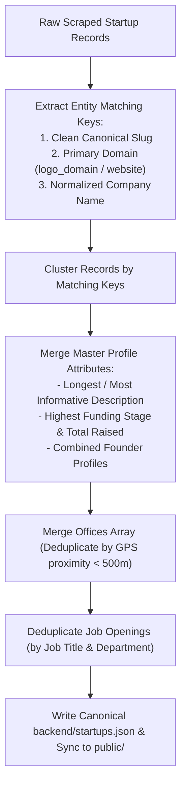

# Data Deduplication & Automated Healing Engine

> Technical guide to entity resolution, canonical slug generation, multi-office merging, continuous revalidation, link health monitoring, and automated dataset healing.

---

## 1. The Challenge of Dataset Hygiene at Scale

Aggregating startup and job data across multiple platforms (LinkedIn, Wellfound, Instahyre, company career pages) creates complex data integrity challenges:
1. **Duplicate Company Records**: The same company appearing under slight name variations (e.g. *"Swiggy"*, *"Swiggy (Bundl Technologies Pvt Ltd)"*, *"Swiggy India"*).
2. **Expired Job Postings**: Tech job listings frequently expire within 30 to 60 days, leading to broken apply links and degraded user trust.
3. **Domain Drift & Broken Logos**: Company website redesigns causing 404 image errors for previously valid logo URLs.
4. **Office Redundancy**: Duplicate office branches generated when multiple scrapers report the same Bangalore or Mumbai office.

---

## 2. Deduplication & Entity Resolution (`deduplicate_startups.py`)

The deduplication engine unifies fragmented records into single canonical startup profiles.



### 2.1 Canonical Slug Generation
Company names are normalized to strip corporate suffixes and special characters:
```python
def generate_canonical_slug(name):
    clean = re.sub(r'\b(pvt|ltd|private|limited|inc|corp|llc|technologies|solutions|india)\b', '', name, flags=re.I)
    slug = re.sub(r'[^a-zA-Z0-9]+', '-', clean).strip('-').lower()
    return slug
```

### 2.2 Multi-Office Proximity Merging
When combining multiple records for the same startup:
* If two offices within the same city have coordinates within **500 meters** of each other, they are merged into a single office record.
* If offices are in different localities or cities (e.g. Bangalore HQ and Mumbai branch), both are preserved in the `offices` array.

---

## 3. Continuous Revalidation & Healing Engine (`revalidate_healing_engine.py`)

The Revalidation Healing Engine operates as an autonomous health auditor that tests every active entity and link in the database.

### 3.1 Audit Dimensions

| Health Check | Method | Healing Action |
| :--- | :--- | :--- |
| **Website Status** | HTTP GET/HEAD request with timeout = 5s | If website returns 404/500 consistently, marks `is_active_website = false` and attempts domain healing. |
| **Logo Availability** | HTTP GET with image MIME header inspection | If logo returns 404, triggers `enrich_all_official_logos.py` to harvest a replacement SVG or high-res favicon. |
| **Job Link Freshness** | HTTP HEAD request on apply URL | If job link returns 404 or redirects to a generic job board homepage, purges the expired job posting. |
| **Coordinate Bounds** | Haversine distance from canonical city center | If office coordinates exceed 80km from city center, runs `fast_precision_geocoder.py` to snap to verified tech park. |

---

## 4. Hourly Background Daemon (`revalidate_hourly_service.py`)

To ensure dataset freshness in production environments, `revalidate_hourly_service.py` runs as a low-overhead daemon:
* Batches audit passes across 50 startups per cycle.
* Enforces jittered delays (200ms–500ms) between external HTTP requests to prevent IP rate-limiting.
* Emits structured JSON audit logs and performance metrics.

---

## 5. Dataset Health Metrics & Quality Scores

The dataset health is audited using `data_acquisition/deep_dataset_auditor.py`:

```bash
# Run comprehensive dataset audit
python3 data_acquisition/deep_dataset_auditor.py
```

### Target Production Quality Baselines
* **Verified Website Availability**: >98.5%
* **High-Resolution Logo Coverage**: >95.0%
* **Precision Geocoding Accuracy**: 100% of offices verified within 80km canonical metro boundaries
* **Zero Duplicate Entities**: 0 duplicate company slugs or identical domain collisions
