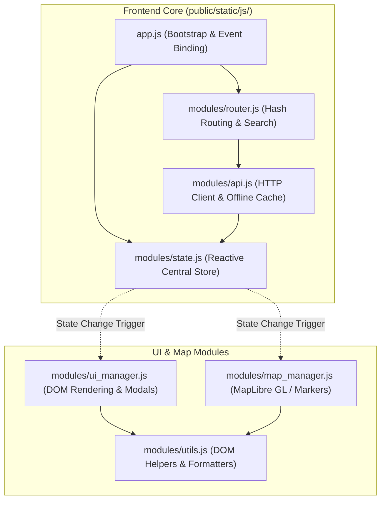

# Frontend Architecture & UX Engineering

> Documentation of the Single Page Application (SPA) architecture, MapLibre GL / Leaflet rendering, reactive state management, responsive UI design, and glassmorphism styling.

---

## 1. Frontend Architectural Philosophy

The MapMyJob frontend is engineered for **instant responsiveness, zero render lag, and high visual appeal**:
1. **Zero Heavy Framework Overhead**: Pure ES6 modular architecture without React/Vue/Angular bundle bloat (<60KB total JavaScript).
2. **Hardware-Accelerated Vector Graphics**: MapLibre GL JS vector tiles with smooth GPU-accelerated camera panning and zooming.
3. **Reactive State Pattern**: Single source of truth state store (`modules/state.js`) with subscriber event dispatching.
4. **Responsive Glassmorphism UI**: Modern translucent frosted-glass panels, backdrop filters, clean typography, and seamless transitions between desktop split-pane and mobile bottom-sheet drawers.



---

## 2. Component & Module Breakdown

### 2.1 State Store (`modules/state.js`)
Centralized state object managing:
* `startups`: Active list of filtered startup entities.
* `markersMap`: Map of active MapLibre marker instances keyed by startup ID.
* `currentSelectedId`: Currently focused company entity.
* `activeFilters`: City, industry, salary minimum, experience level, job type.
* `geocodeCache`: In-memory LRU cache of resolved geocode bounding boxes.
* `isProgrammaticMove`: Mutex preventing user pan events from firing during automated camera transitions.

### 2.2 Map Manager (`modules/map_manager.js`)
* **Vector Map Configuration**: MapLibre GL container styled with CartoDB Voyager GL theme (`dragRotate: false`, `touchZoomRotate: true`).
* **India Boundary & Water Styling**: Loads `india_mask.geojson` and `india_high_res.geojson` to highlight Indian territory and apply crisp ocean blue fills.
* **Industry Color Palette**:
  - 🟣 **Artificial Intelligence**: `#7e22ce` (Purple)
  - 🟢 **CleanTech**: `#15803d` (Green)
  - 🌲 **HealthTech**: `#047857` (Emerald)
  - 🟠 **Fintech**: `#c2410c` (Orange)
  - 🔷 **B2B / SaaS**: `#0369a1` (Sky Blue)
  - 🌸 **E-commerce**: `#be185d` (Pink)
  - ⚡ **EdTech**: `#b45309` (Amber)
  - 🛡️ **Cybersecurity**: `#475569` (Slate)
  - 🚀 **Logistics**: `#4f46e5` (Indigo)

### 2.3 UI Manager (`modules/ui_manager.js`)
* **Company List Sidebar**: Virtualized list rendering company cards with verified headcount, funding stage, open job counts, and industry tags.
* **Company Detail Drawer**: Sliding drawer displaying company overview, verified founders with LinkedIn shortcuts, office addresses with copy buttons, and interactive job accordions.
* **Job Application Accordion**: Rich cards showing required skills, experience levels, salary CTC, and direct apply links.

### 2.4 Hash Routing (`modules/router.js`)
* Supports direct deep links:
  - `#company_id=142`: Automatically pans map to company coordinate and opens detail drawer.
  - `?city=Bengaluru&q=Frontend`: Pre-filters directory and adjusts viewport.

---

## 3. Responsive Layout Design

```text
DESKTOP VIEW (>1024px)
┌─────────────────────────────────────────────────────────────┐
│ Navbar: Search City/Location | Keyword | Filters | Profile  │
├───────────────────┬─────────────────────────────────────────┤
│                   │                                         │
│ Company Directory │ Interactive Vector Map                  │
│ Sidebar (380px)   │ (Full Viewport Canvas)                  │
│                   │ - Marker Clustering                     │
│ - Company Cards   │ - Spiral Layout Deconfliction           │
│ - Filter Chips    │ - Dynamic Viewport Culling              │
│ - Job Count Badge │                                         │
│                   │                                         │
├───────────────────┴─────────────────────────────────────────┤
│ Sliding Detail Drawer (Overlays right pane upon selection)   │
└─────────────────────────────────────────────────────────────┘

MOBILE VIEW (<768px)
┌─────────────────────────────────────────────────────────────┐
│ Top Navbar & Search Bar                                     │
├─────────────────────────────────────────────────────────────┤
│ Full Screen Map Viewport                                    │
│                                                             │
├─────────────────────────────────────────────────────────────┤
│ Bottom Sheet Drawer (Draggable / Expandable List)           │
│ - Quick Swiping between Map & List                          │
└─────────────────────────────────────────────────────────────┘
```

---

## 4. Performance Optimizations

1. **Lazy Image Loading**: Company logo images use native browser `loading="lazy"` and decoding optimization.
2. **DOM Caching & Marker Reuse**: `updateMarkersDiff()` only instantiates new DOM nodes for newly added companies, reusing existing marker elements during panning.
3. **Debounced Search**: Search input triggers with 250ms debounce delay, preventing redundant network requests while typing.
