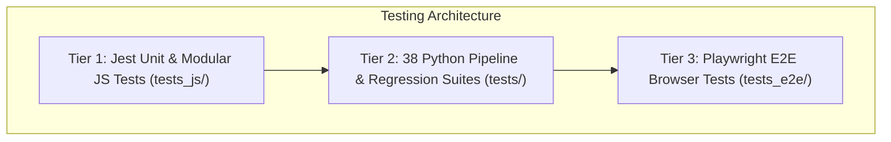

# Testing & QA Strategy

> Comprehensive guide to unit testing, integration testing, 38 Python test suites, Playwright End-to-End (E2E) browser testing, and regression verification.

---

## 1. Testing Framework Overview

Quality Assurance is enforced through a **3-tier testing pyramid**:
1. **Jest Unit & Modular Tests (`tests_js/`)**: Fast, isolated Node.js unit tests validating router dispatch, input sanitizers, salary parsers, and mock edge requests.
2. **Python Pipeline & Adversarial Suites (`tests/` - 38 suites)**: Comprehensive regression, crawl queue concurrency, geocoding precision, OAuth security, and revalidation suites.
3. **Playwright E2E Browser Testing (`tests_e2e/`)**: Headless browser automation testing real user journeys, marker interactions, mobile responsiveness, and visual consistency.



---

## 2. Unit & Integration Tests (Jest)

Located in `tests_js/`:
* `unified_router.test.js`: Validates all REST API routes, parametric URL matching (`/api/startups/:id`), query string parsing, CORS preflight headers, and error responses.
* `unit_modular.test.js`: Validates salary string parsing (`parseMaxSalary`), experience matching (`matchExpLevel`), and remote office classification.
* `static_layout.test.js`: Tests HTML structure, semantic tags, and asset link integrity.

### Running Jest Tests
```bash
npm test
```

---

## 3. Python Test Suites (`tests/`)

The Python test suite contains **38 comprehensive test files** covering all aspects of data acquisition, security, and edge rendering:

### 3.1 Pipeline & Crawler Tests
* `test_data_acquisition_pipeline.py`: Validates end-to-end data acquisition from discovery to DB merge.
* `test_crawler_unit.py`: Tests individual scraper modules with mock network responses.
* `test_async_crawler_queue.py`: Concurrency test simulating multiple workers popping tasks simultaneously using `BEGIN IMMEDIATE TRANSACTION`.

### 3.2 Geocoding & Remediation Tests
* `test_india_remediation.py`: Validates that all coordinates fall strictly within canonical Indian bounds (`6.0°N–37.0°N, 68.0°E–98.0°E`).
* `test_remote_office_location.py` & `test_remote_unpinned.py`: Ensures remote offices are not falsely plotted on physical map locations.
* `test_tokenized_search.py`: Verifies multi-word locality and company token search matching.

### 3.3 Revalidation & Healing Tests
* `test_revalidation_healing_engine.py`: Tests automated link checking and website health auditing.
* `test_adversarial_revalidation.py`: Injects broken URLs, malicious redirects, and 500 error scenarios to verify graceful fallback.
* `test_revalidate_hourly_service.py`: Verifies background daemon throttling and metrics recording.

### 3.4 Security & Storage Tests
* `test_oauth_security.py`: Tests Google OAuth PKCE token exchange, CSRF state verification, and JWT expiration.
* `test_d1_adversarial.py`: Tests SQL injection prevention and schema integrity for Cloudflare D1.
* `test_d1_profile_bookmarks.py`: Validates bookmark persistence across user sessions.

### 3.5 Viewport & Scalability Tests
* `test_viewport_caching_e2e.py` & `test_viewport_caching_m2.py`: Measures memory usage and response times during rapid map panning.
* `test_viewport_mode_transition.py`: Tests state preservation when switching between desktop split-pane and mobile drawer modes.
* `test_scalability_bounds.py`: Stress-tests database filtering with 10,000+ startup records.

### Running Python Tests
```bash
# Run all Python test suites
python3 run_tests.py

# Run specific test suite with pytest
pytest tests/test_tokenized_search.py -v
```

---

## 4. Playwright End-to-End (E2E) Browser Testing

Located in `tests_e2e/`:
* `e2e_production.spec.js`: Tests the complete production user workflow (landing page load, search execution, company card click, detail drawer inspection, job link navigation).
* `interactive_qa.spec.js`: Tests interactive UI elements (filter dropdowns, clear buttons, keyboard shortcuts, map marker tooltips).
* `mobile_responsiveness.spec.js`: Simulates mobile devices (iPhone 14, Pixel 7) testing touch drag gestures on the bottom-sheet drawer.

### Running Playwright Tests
```bash
# Run all E2E browser tests
npm run test:e2e

# Run with interactive UI mode
npx playwright test --ui
```

---

## 5. Continuous Integration & Pre-Commit Validation

Before deploying to production via `wrangler deploy`, the following validation pipeline must pass:

```bash
# 1. Run JS Unit Tests
npm test

# 2. Run Python Regression Suites
python3 run_tests.py

# 3. Run E2E Smoke Tests
npm run test:e2e
```
