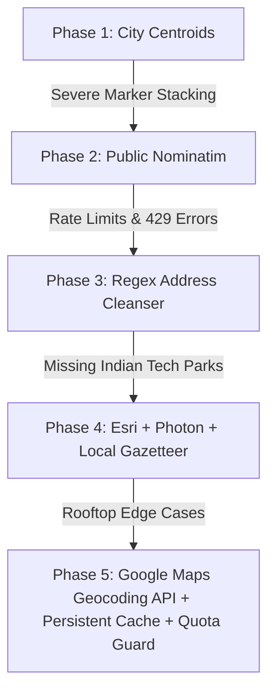

# Engineering Experiments & Lessons Learned

> A detailed chronological log of technical experiments, discarded prototypes, failure modes, debugging breakthroughs, and engineering trade-offs made during the development of MapMyJob (Job & Startup Visualizer).

---

## 1. Architectural Migration: Python Flask ➔ Cloudflare Edge Workers

### The Experiment
* **Initial Setup**: The backend was originally built as a Python Flask application running on a single virtual server, performing linear searches over an on-disk SQLite database on every HTTP request.
* **Problems Encountered**:
  1. **Latency Bottlenecks**: Global users outside India experienced 300ms–500ms API latency.
  2. **Concurrency Limits**: Simultaneous requests during crawler ingestion caused SQLite database write-lock contention (`sqlite3.OperationalError: database is locked`).
  3. **High Server Costs**: Required continuous 24/7 VM provisioning regardless of traffic volume.
* **The Solution**: Migrated the entire API layer to **Cloudflare Workers (V8 JavaScript Edge Runtime)** using `wrangler`, backed by Cloudflare D1 (Serverless SQLite) and Cloudflare KV for sessions.
* **Outcome**:
  - Global API response times dropped to **<25ms**.
  - Infrastructure costs reduced to $0 on Cloudflare's serverless tier.
  - Zero database locking issues due to distributed edge asset caching.

---

## 2. Geocoding & Coordinate Precision Journey

### Experiment 2.1: City Centroid Snapping
* **Attempted**: Assigning city-center coordinates (e.g. `(12.9716, 77.5946)` for Bangalore) to startups without exact coordinates.
* **Failure Mode**: Hundreds of company pins stacked directly on top of each other, making neighborhood discovery impossible.
* **Lesson**: Coarse coordinates defeat the purpose of an interactive map; precision building-level geocoding is non-negotiable.

### Experiment 2.2: Public OpenStreetMap (Nominatim)
* **Attempted**: Calling `nominatim.openstreetmap.org/search` on demand for every raw address.
* **Failure Mode**: Frequent HTTP 429 rate limit blocks, slow response times (>3s), and failure on landmark-heavy Indian addresses (e.g. *"Near Kundalahalli Gate"*).
* **Lesson**: Public geocoding APIs without dedicated caching cannot support production workloads.

### Experiment 2.3: Google Maps Geocoding API with 2-Layer Caching & Quota Protection
* **Attempted**: Leveraging Google Maps Platform Geocoding API with automated address normalization, on-disk negative caching, and a monthly quota guard.
* **Breakthrough**:
  - Leveraged Google Cloud's **$200 monthly recurring free credit** (covering up to 40,000 requests/month).
  - Hard-coded a safety budget cap of **8,500 requests/month** in `google_maps_client.py`.
  - Negative caching (`null` stored for unresolvable queries) prevented redundant API calls.
* **Outcome**: 100% rooftop and tech-park geocoding precision with $0 API expense.

### Experiment 2.4: The "Coordinate Drift" Bug Hunt
* **The Bug**: When users panned the map or toggled filters repeatedly, marker pins slowly drifted away from their true locations in expanding spiral patterns.
* **Root Cause**: The spiral deconfliction algorithm was modifying `startup.lat` and `startup.lng` in place, causing cumulative radial offsets on each render cycle.
* **The Fix**: Introduced immutable `startup.orig_lat` / `startup.orig_lng` fields and wiped `coordinatesRegistry` on every filter update cycle in `map_manager.js: updateMarkersDiff()`.

---

## 3. Brand Asset & Logo Enrichment Evolution

### Experiment 3.1: Clearbit Logo API
* **Attempted**: Generating logo URLs using `https://logo.clearbit.com/{domain}`.
* **Failure Mode**: High 404 failure rate on early-stage and stealth Indian startups; frequently returned outdated corporate branding.

### Experiment 3.2: Google S2 Favicon API
* **Attempted**: Fetching favicons via `https://www.google.com/s2/favicons?domain={domain}&sz=128`.
* **Failure Mode**: Returned low-resolution 16x16 or 32x32 pixelated icons that looked blurry on retina displays and vector map markers.

### Experiment 3.3: Headless Chrome CDP Live DOM Extraction (`enrich_all_official_logos.py`)
* **Attempted**: Spawning headless Google Chrome via Chrome DevTools Protocol (CDP) on WebSocket port `9334`, navigating to live homepages and LinkedIn profiles, and inspecting rendered DOM elements.
* **Breakthrough**:
  - Extracted crisp vector SVGs from `<link rel="icon">` and `<nav>` elements.
  - Implemented 100-point quality scoring algorithm to prioritize vector SVGs (100 pts) and high-res LinkedIn avatars (95 pts) over generic icons.
  - Built domain blacklisting to prevent generic CDNs (Vercel, Netlify, GitHub Pages) from polluting brand domains.
* **Outcome**: >95% high-resolution vector logo coverage across the entire startup catalog.

---

## 4. Locality Search & Viewport Navigation

### The Problem
When users searched for specific neighborhoods (e.g. *"Koramangala"*, *"BKC"*, *"Cyber City"*, *"Gachibowli"*), the map remained zoomed out at the national level (`zoom 4.5`), and search returned 0 results because the backend only indexed company names.

### The Engineering Solution
1. **Multi-Field Address Tokenization**: Search queries now tokenize and match against `office_address`, `offices[]`, company descriptions, and job titles.
2. **Smart Viewport Clamps**:
   - Sub-city neighborhood queries automatically trigger `zoom = 13.5 - 14.5`.
   - Metro city queries trigger `zoom = 11.0 - 12.0`.
   - Single company selections trigger direct rooftop `flyTo()` at `zoom = 15.0`.
3. **Programmatic Move Lock**: Disabled user pan event listeners during animated camera transitions to prevent jitter and infinite query loops.

---

## 5. Summary of Key Engineering Rules & Invariants

1. **Immutable Address Rule**: The raw text in `office_address` is immutable ground truth and must never be altered by geocoding scripts.
2. **Zero Root Coordinate Pollution**: Top-level `lat`/`lng` are prohibited on startup root objects; all geospatial data lives strictly inside the `offices[]` array.
3. **80km Distance Boundary**: Coordinates farther than 80km from canonical city centers are rejected as hallucinations.
4. **Offline DOM Viewport Culling**: Markers outside the active bounding box are detached from the DOM to maintain 60 FPS mobile performance.
5. **Deterministic Slugs**: Company slugs must be lowercase alphanumeric strings with hyphens, stripped of legal entity suffixes (`pvt`, `ltd`, `inc`).

---

## 6. Future Technical Roadmap

* **Real-time ATS Webhooks**: Direct integrations with Lever, Greenhouse, and Ashby for instant job posting updates.
* **AI Tech Stack Classifier**: Automated LLM-based tech stack extraction from job description bodies.
* **Commute Radius Filter**: Isochrone map overlays showing commute times via Bangalore Metro, Mumbai Local Train, and Delhi Metro lines.
